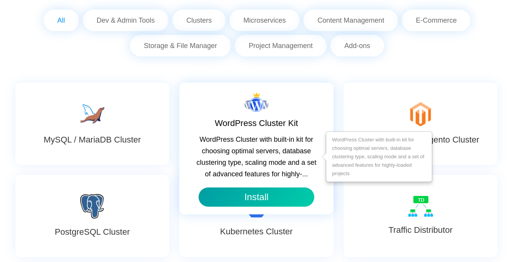

# Jelastic Marketplace Widget

This repository provides a source code of the Jelastic Marketplace widget that can be integrated into any website.

[Jelastic Marketplace](https://jelastic.com/marketplace/#marketplace) features numerous (50+) pre-packaged solutions that can be hosted in a matter of minutes with just a few simple clicks. Installation, configuration, and optimization of all the packages are offered for free, e.g. WordPress (standalone and cluster), Kubernetes Cluster, Docker Swarm, various database clusters, Magento, Jenkins, Drupal, GitLab, etc. The list is conveniently divided into categories to easily locate the required application.

The Jelastic Marketplace widget does not depend on any external software, and all the required configs are provided within the current repository. As a result, the integration to any website can be done in a few simple steps:

1. Download the **mp-widget** directory with the required files. For instance, with the following command:
    
    `git clone https://github.com/jelastic/jelastic-marketplace-widget.git`
    > **Note:** The **mp-widget** folder should be located at the root folder of your site.
1. Enable scripts on your server by adding the following lines between the `<head>` and `</body>` tags:
    
    ``
    
    `<link rel="stylesheet" href="{siteUrl}/mp-widget/css/j-marketplace.min.css">`

    Ensure that provided **{siteUrl}** is specified correctly.

1. Add the following block to your page code at the position you’d like the widget to be placed at:

    `

`

1. The repository provides complete source code of the Jelastic Marketplace widget, which is built with the help of the [Grunt](https://gruntjs.com/) project builder to compile and minimize .js scripts and .less files. If needed, you can utilize Grunt to redefine default styles and change the widget up to your needs.

    More details about the installation and customization of the marketplace are [described in the documentation](https://ops-docs.jelastic.com/custom-marketplace-widget).
